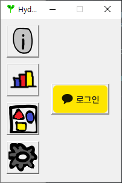
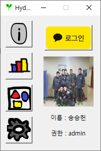
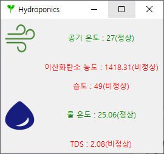
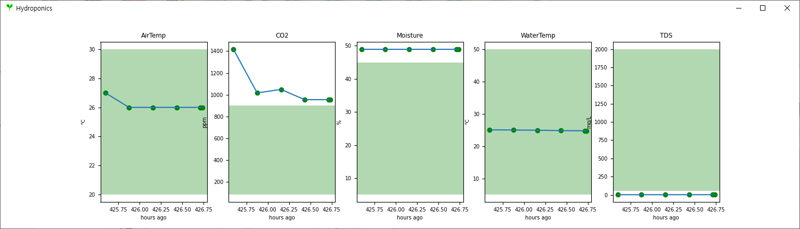
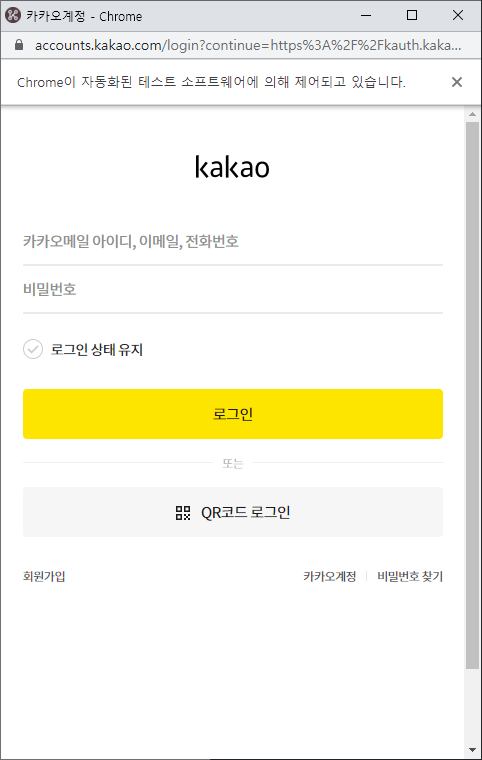
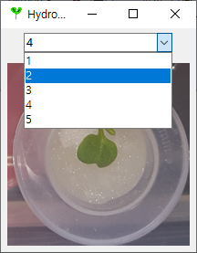
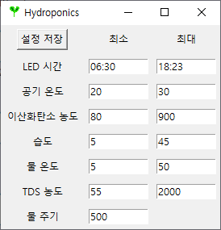

# Hydroponics-Desktop-App

## Overview
1. [ScreenShot](#ScreenShot)
2. [Requirement](#Requirement)
3. [Reference](#Reference) 
## ScreenShot

</img>
</img> 
</img>
</img>
</img>
</img>
</img>

  

## Requirement

- celenium을 사용하므로 크롬과 크롬 드라이버가 반드시 설치되어있어야합니다.
  - 크롬 드라이버 다운로드 링크 https://chromedriver.chromium.org/downloads
- http 서버와 통신을 위해 requests 모듈이 필요합니다.
- gui 구성을 위해 tkinter 모듈이 필요합니다.
- 이미지 사이즈 조정을 위해 PIL 모듈이 필요합니다.
- 그래프를 그리기 위해 matplotlib 모듈이 필요합니다.

## Reference

- 참고링크 참조
